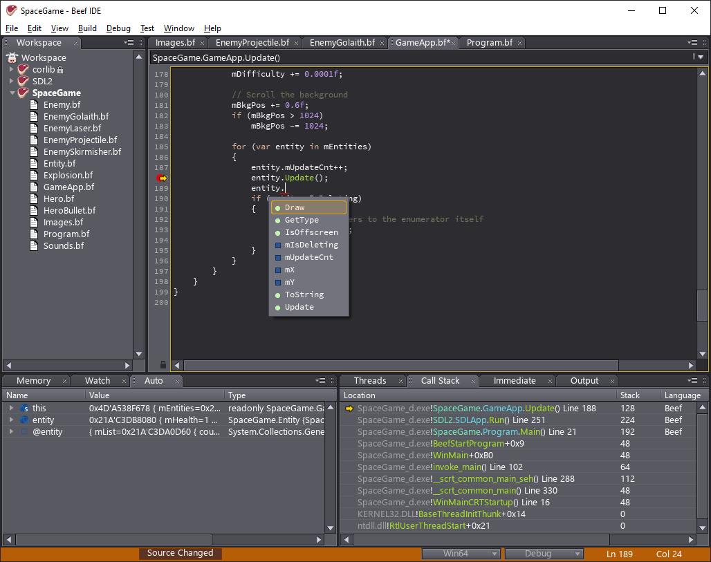

# Beef Programming Language

Beef is an open source performance-oriented compiled programming language which has been built hand-in-hand with its IDE environment. The syntax and many semantics are most directly derived from C#, while attempting to retain the C ideals of bare-metal explicitness and lack of runtime surprises, with some "modern" niceties inspired by languages such as Rust, Swift, and Go. See the [Language Guide](https://www.beeflang.org/docs/language-guide/) for more details.

Beef's primary [design goal](https://www.beeflang.org/docs/foreward/) is to provide a fluid and pleasurable development experience for high-performance real-time applications such as video games, with low-level features that make it suitable for engine development, combined with high-level ergonomics suitable for game code development.

Beef allows for safely mixing different optimization levels on a per-type or per-method level, allowing for performance-critical code to be executed at maximum speed without affecting debuggability of the rest of the application.

Memory management in Beef is manual, and includes first-class support for custom allocators. Care has been taken to reduce the burden of manual memory management with language ergonomics and runtime safeties &ndash; Beef can detect memory leaks in real-time, and offers guaranteed protection against use-after-free and double-deletion errors. As with most safety features in Beef, these memory safeties can be turned off in release builds for maximum performance.

The Beef IDE supports productivity features such as autocomplete, fixits, reformatting, refactoring tools, type inspection, runtime code compilation (hot code swapping), and a built-in profiler. The IDE's general-purpose debugger is capable of debugging native applications written in any language, and is intended to be a fully-featured standalone debugger even for pure C/C++ developers who want an alternative to Visual Studio debugging.

# Binaries and Documentation

[Official website (beeflang.org)](https://www.beeflang.org) 
[Documentation](https://www.beeflang.org/docs/) 
[Stable Releases](https://github.com/beefytech/Beef/releases) 
[Nightly Windows Release](http://nightly.beeflang.org/BeefSetup.exe) 

# IDE Screenshots

